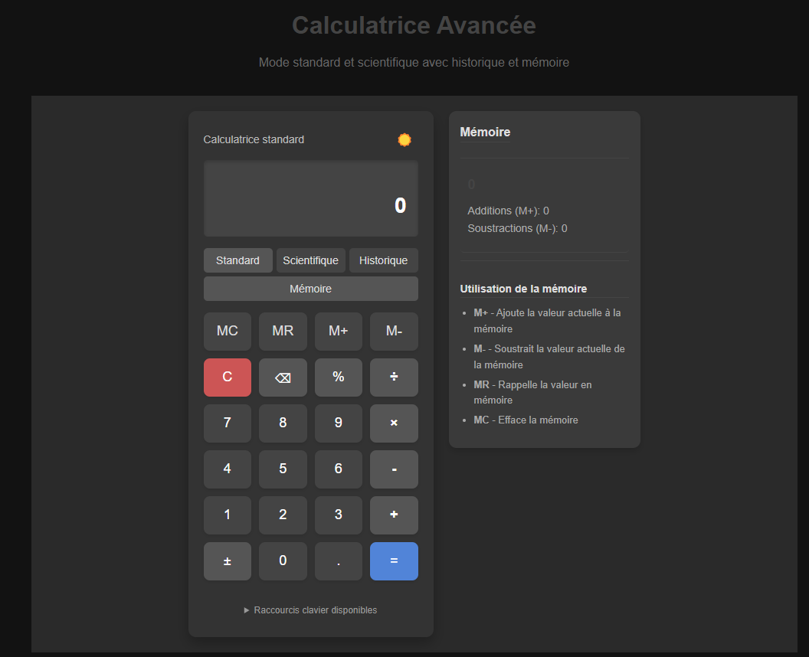

Calculatrice Scientifique React

Une calculatrice scientifique avancée développée avec React, offrant des fonctionnalités standard et scientifiques, ainsi qu'un système d'historique et de mémoire.



## ✨ Fonctionnalités

### 🧠 Calculs avancés
- Opérations scientifiques (sin, cos, tan, log, ln)
- Gestion des parenthèses et priorités
- Mode degrés/radians
- Constantes mathématiques (π, e)

### 💾 Mémoire
- Système complet M+/M-/MR/MC
- Historique des calculs
- Réutilisation des résultats

### 🎨 Interface
- Thème clair/sombre
- Animations fluides
- Design responsive
- Raccourcis clavier

## 🚀 Installation

```bash
# Cloner le dépôt
git clone https://github.com/wilfriednanvou/calculatrice-react.git

# Installer les dépendances
npm install

# Lancer l'application
npm start

🛠 Technologies

React 18 avec Hooks
CSS Modules pour le styling
ESLint/Prettier pour la qualité de code
gitHub Actions pour le CI/CD

📂 Structure du projet
src/
├── components/          # Composants UI
│   ├── Affichage.jsx    # Zone de résultat
│   ├── ClavierStandard.jsx
│   ├── ClavierScientifique.jsx
│   ├── PanneauHistorique.jsx
│   └── PanneauMemoire.jsx
├── hooks/               # Logique métier
│   └── useCalculatrice.js
├── styles/              # Styles CSS
│   └── Calculatrice.css
└── App.js               # Composant principal

⌨️ Raccourcis clavier
Touche	    Fonction
0-9	        Chiffres
+ - * /	    Opérateurs
Enter ou =	Calculer
Escape	    Effacer tout
Backspace	Retour arrière
( )	        Parenthèses
Ctrl+M	    Changer de mode
Ctrl+H	    Afficher historique
Ctrl+D	    Changer de thème

🤝 Contribuer
Forkez le projet

Créez une branche (git checkout -b feature/amazing-feature)

Committez (git commit -m 'Add amazing feature')

Poussez (git push origin feature/amazing-feature)

Ouvrez une Pull Request

📜 License
MIT © [Wilfried & Andrade] - Voir LICENSE pour plus de détails.